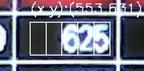

# Setup
```bash
git clone https://github.com/mmov1099/monitor_recognition.git
cd develop/monitor_recognition
pip install -r requirements.txt
```
If an error occurs during installation pytorch

Please adapt to your environment　[参考](https://pytorch.org/get-started/locally/)
```bash
pip install torch torchvision torchaudio --extra-index-url https://download.pytorch.org/whl/cu116
```
# Usage
```bash
pwd # /monitor_recognition
```
1. Bring monitor images to `monitor_recognition/imgs/`. The name of imges format is `Y-m-d_H-M-S`. exp) 2023-01-28_15-47-44.png.
2. Make data for training mynet.pth.
```bash
python main.py --make_data
```
3. First GUI window is for monitor detection. Left-click on the four corners of the monitor in the following order: upper left, upper right, lower right, lower left. After that Left-click and you can save monitor image. Exit with esc key.
4. Second GUI window is for text detection. Select the cells with numbers in the table by `--num_digits` to match the number of digits, and right-click to save the selection so that the numbers are neatly separated by a rectangle that appears when left-clicked. Please work from the top left cell to the right. The height and width of the square can be changed by `--height` and `--width`. They can also be changed by pressing the h or w key.



When you have finished selecting all cells, press the esc key to exit.
5. Create dataset for training. The digit imgs are saved in `result/gui/`. Move them to a directory same as label.
```
imgs
├── dataset
│   ├── 0
│   │   ├── image0.jpg
│   │   ├── image1.jpg
│   │   ...
│   ├── 1
│   ├── 2
│   ├── 3
│   ├── 4
│   ├── 5
│   ├── 6
│   ├── 7
│   ├── 8
│   ├── 9
│   ├── dot
│   ├── minus
│   └── none

```
6. Train mynet.
```bash
python scripts/my_net.py
```
options
```bash
python scripts/my_net.py -h
```
```bash
usage: my_net.py [-h] [--model_name MODEL_NAME] [--model_type {cnn,mlp}] [--num_batch NUM_BATCH] [--num_epochs NUM_EPOCHS]
                 [--height HEIGHT] [--width WIDTH]

optional arguments:
  -h, --help            show this help message and exit
  --model_name MODEL_NAME
                        the name of a saving text recog model
  --model_type {cnn,mlp}
                        choose mynet type
  --num_batch NUM_BATCH
  --num_epochs NUM_EPOCHS
  --height HEIGHT       height of each image
  --width WIDTH         width of each image
```
7. Recog images and create table.csv
```bash
python main.py
```
8. Convert table.csv to time serial csv file for each parameter.
```bash
python scripts/table2serial_param.py
```
## main.py options
```bash
python main.py -h
```
```bash
usage: main.py [-h] [--img_dir IMG_DIR] [--test] [--make_data] [--detect_monitor_gui] [--detect_text_gui]
               [--num_digits NUM_DIGITS] [--height HEIGHT] [--width WIDTH] [--model_name MODEL_NAME]
               [--mynet_type {cnn,mlp}] [--gray_threshold GRAY_THRESHOLD]

optional arguments:
  -h, --help            show this help message and exit
  --img_dir IMG_DIR     folder path to input images
  --test                save result in each process
  --make_data           make digits data for training mynet
  --detect_monitor_gui  run detect monitor gui forcely
  --detect_text_gui     run detect text gui forcely
  --num_digits NUM_DIGITS
                        a number of digits of each cell of monitor
  --height HEIGHT       default height value of each text of monitor table
  --width WIDTH         default width value of each text of monitor table
  --model_name MODEL_NAME
                        the name of a saving text recog model
  --mynet_type {cnn,mlp}
                        choose mynet type
  --gray_threshold GRAY_THRESHOLD
                        gray threthold for trimed image in recognition text
```
